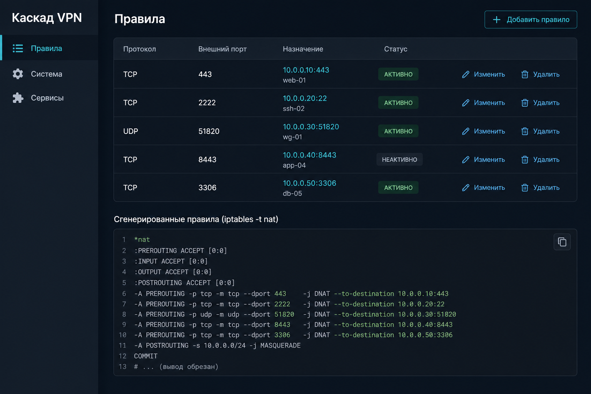

# kaskad_web_vpn — каскад NAT под ключ

## Скриншот интерфейса

Ниже — **иллюстрация** общего вида панели (правила проброса, система, iptables); для маркетинга лучше подставить **живой** скрин с вашего сервера тем же именем файла:

<p align="center">

</p>

При желании замените файл **`docs/screenshots/kaskad-panel-overview.png`** на скрин с вашего сервера.

## Установка под ключ

На VPS под root:

```bash
curl -fsSL https://raw.githubusercontent.com/andrey271192/kaskad_web_vpn/main/install.sh | sudo bash
```

Дальше откройте в браузере **`http://<IP сервера>:8088/setup`** и задайте пароль (или передайте **`ADMIN_PASSWORD`** при установке — см. ниже).

Удаление:

```bash
curl -fsSL https://raw.githubusercontent.com/andrey271192/kaskad_web_vpn/main/uninstall.sh | sudo bash
```

## Первый вход и пароль

- По умолчанию пароль **не** подставляется в Docker: страница **`/setup`** (файл **`/var/lib/kaskad/web_auth.json`** на томе).
- Готовый пароль при установке: **`ADMIN_PASSWORD='…'`** или файл **`PASSWORD_FILE`**.
- Случайный пароль в файл: **`FORCE_RANDOM_PASSWORD=1`**.

## Как устроен NAT

Переменная **`KASKAD_IPTABLES_MODE`** (install передаёт **`compat`** по умолчанию):

| Значение | Описание |
|----------|----------|
| **`compat`** | Классический каскад: **DNAT** в **`nat/PREROUTING`**, правила **INPUT** и **FORWARD** с меткой **`kaskad:PORT:proto`**, **MASQUERADE** на исходящем интерфейсе (авто или **`KASKAD_OUT_IFACE`**). |
| **`chain`** | Отдельная цепочка **`nat/KASKAD_WEB`** и переход из PREROUTING. |

Нужно **`net.ipv4.ip_forward=1`**. Контейнер обычно с **`--network host`** и **`--privileged`**. Данные правил: **`KASKAD_DATA_DIR`** → `rules.json`.

## Требования

- Linux, Docker, для NAT — host network и privileged (как в скрипте).

## Если сборка образа ругается на подпись apt

```bash
docker builder prune -af
docker build --pull --no-cache -t kaskad-web-vpn:test .
```

Проверьте время (`date -u`), место на диске, при необходимости отключите HTTP-прокси при сборке.

## Переменные install.sh

| Переменная | По умолчанию | Описание |
|------------|--------------|----------|
| `HOST_PORT` | `8088` | порт HTTP |
| `KASKAD_HOST_NETWORK` | `1` | host network / или `-p` |
| `KASKAD_DATA_DIR` | `/var/lib/kaskad` | том данных |
| `KASKAD_IPTABLES_MODE` | `compat` | `compat` или `chain` |
| `ADMIN_PASSWORD` | — | пароль без `/setup` |
| `FORCE_RANDOM_PASSWORD` | `0` | автопароль в `PASSWORD_FILE` |
| `PASSWORD_FILE` | `/root/kaskad_web.initial-password` | чтение/запись пароля |
| `BASIC_AUTH_USER` | `user1` | логин при env-пароле |
| `PANEL_URL` | — | доп. ссылка в шапке |
| `KASKAD_REPO` | `andrey271192/kaskad_web_vpn` | откуда качать исходники |

## Переменные приложения

| Переменная | Описание |
|------------|----------|
| `KASKAD_UI_VERSION` | строка версии в блоке «Система» |
| `SERVICE_UNITS` | CSV systemd-юнитов для таблицы (первые строки); третья строка может быть статусом Docker-контейнера панели |
| `DOCKER_WEB_CONTAINER`, `DOCKER_WEB_DISPLAY_UNIT` | контейнер и подпись в «Сервисах» |
| `KASKAD_OUT_IFACE` | интерфейс для MASQUERADE |
| `WEB_AUTH_JSON` | путь к файлу пароля веб-интерфейса |

Примеры установки с паролем и портом:

```bash
curl -fsSL https://raw.githubusercontent.com/andrey271192/kaskad_web_vpn/main/install.sh | sudo \
  env ADMIN_PASSWORD='ваш_секрет' HOST_PORT=8443 bash
```

## Локальный запуск (без Docker)

```bash
pip install -r requirements.txt
sudo -E env PATH="$PATH" flask --app app run --host 0.0.0.0 --port 8088
```

`GET /health` без авторизации. `GET /api/meta` — `needs_setup`, режим iptables.

## API

После Basic Auth: `/api/system`, `/api/services`, `/api/clients`, CRUD клиентов, `/api/iptables/raw`.

## Лицензия

MIT

---

## Поддержка проекта

---

- ⭐ **GitHub:** [andrey271192/kaskad_web_vpn](https://github.com/andrey271192/kaskad_web_vpn)
- 💖 **Boosty:** [boosty.to/andrey27/donate](https://boosty.to/andrey27/donate)
- 💳 **Ozon Bank (СБП):** [ссылка](https://finance.ozon.ru/apps/sbp/ozonbankpay/019dc200-2a5d-7931-a619-782d285f6798)
- ✉️ **Telegram:** [@lot_andrey](https://t.me/lot_andrey)
